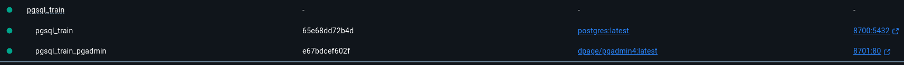

This repo contains the basic code needed to setup the following:
- A PostgreSQL database server with a predefined user, password, and database
- A pgAdmin web interface for database management
- A Docker networking setup for communication between services

## Docker Compose Configuration

The `docker-compose.yml` file sets up the following components:

### PostgreSQL Database
- **Image**: PostgreSQL latest version
- **Container Name**: `pgsql_train`
- **Credentials**:
  - Username: `theuser`
  - Password: `thepassword`
  - Database: `thedb`
- **Port**: Mapped from `8700` on host to default PostgreSQL port `5432` in container
- **Persistence**: Data is stored in a Docker volume named `postgres_data`

### pgAdmin Web Interface
- **Image**: pgAdmin4 latest version
- **Container Name**: `pgsql_train_pgadmin`
- **Credentials**:
  - Email: `admin@admin.com`
  - Password: `admin`
- **Port**: Available at `http://localhost:8701` (mapped from host port `8701` to container port `80`)
- **Dependencies**: Only starts after PostgreSQL service is running

### Network and Storage
- **Network**: All services run on a custom bridged network named `pgsql_train_network`
- **Volume**: PostgreSQL data is persisted through a named Docker volume

## Getting Started

1. Make sure you have Docker and Docker Compose installed on your system
2. Clone this repository
3. Start the services:
   ```bash
   docker-compose up -d
   ```


4. Access pgAdmin at http://localhost:8701
   - Login with email: `admin@admin.com` and password: `admin`
   - Connect to the PostgreSQL server with:
     - Host: `postgres` (service name in the Docker network)
     - Port: `5432` (default PostgreSQL port inside the container)
     - Username: `theuser`
     - Password: `thepassword`
     - Database: `thedb`

## Usage with Python

The `main.py` file contains code for connecting to the PostgreSQL database using Python. To use it:

1. Install required Python packages using uv:
   ```bash
   uv sync
   ```
   
2. Run the example code:
   ```bash
   uv run python main.py
   ```

## Shutting Down

To stop the services while preserving data:
```bash
docker-compose down
```

To stop the services and remove all data:
```bash
docker-compose down -v
```